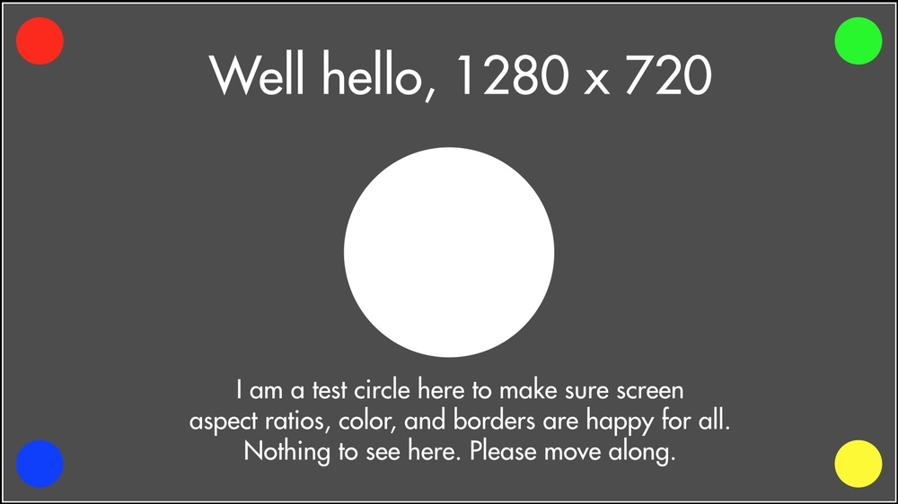
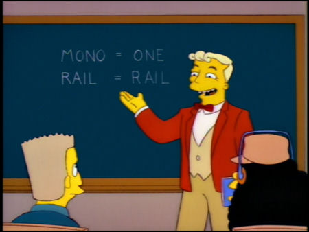
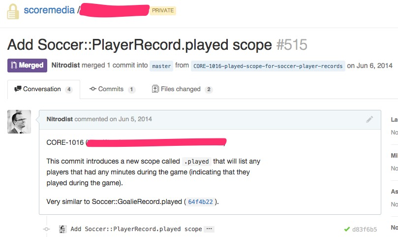
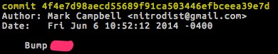
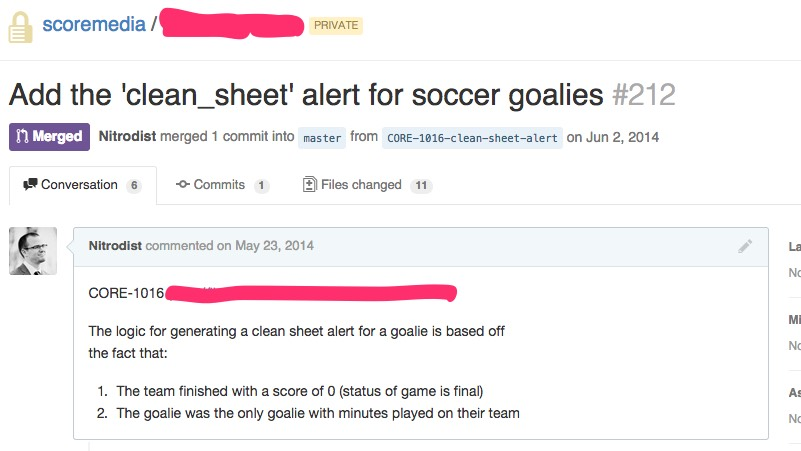

---

# [fit] Ungemifying your projects

### (one repo to rule them all)

---


# Sportsball! Also eSports.

### (we're hiring!)

---

let's talk about

# [fit] MONORAILS

---

# What's a monorail?

A rails app that does *everything*

1. The website
2. API
3. Background jobs
4. Search
5. 3rd party service interaction
6. Kitchen sink duties



---

# Why are monorails bad?

* No clear separation of concerns
* All code is loaded, even if you don't use it
* Scaling concerns (naïve scaling means everything is scaled)
* Test suite runs everything by default

---

# What can we do?

Let's split up app into separate pieces!

Models are usually the only thing needed in each component, so let's just gemify that.

---

# The code

```ruby
# Gemfile
gem 'mycompany-models',
    git: 'git@github.com:mycompany/mycompany-models.git',
    branch: 'master'
```

```
# Gemfile.lock
GIT
  remote: git@github.com:mycompany/mycompany-models.git
  revision: 976fea8d33e36ce3d63b08375626b6475b1f8ac2
  branch: master
  specs:
    mycompany_models (1.6.11)
      activerecord (~> 3.2.6)
      activesupport (~> 3.2.6)
```

^ point out downside of the revision being mentioned

--- 

# Workflow

1. Push code to master branch of `mycompany-models`
2. Update downstream projects:

```sh
# in terminal
bundle update mycompany-models
```

^ *so* many times we typed `bundle update`

---

# Downsides of gemifying

* Code changes between gemified project and downstream project are tied together
* Multiple pull requests for the same issue!
* Order of merging pull requests is important
* Can forget about some pull requests

^ talk about confusion of multiple pull requests for one issue

^ talk about tests/code failing in downstream projects because of model changes

^ talk about apps breaking because someone forgot to bump the model gem

---

Model


Downstream Project


^ two pull requests, 3 commits

^ 5 commits if you count the merge commits

---

# The Solution

---

# One repo
# Multiple projects

--- 

# Directory structure

```sh
$ ls -al mycompany
mycompany-api/
mycompany-models/
mycompany-search/
circle.yml
README.md
specs.sh # run all the tests!
.gitignore
.hound.yml

```

^ specs.sh is what circle ci runs

^ bonus: the hound config is shared between all projects

---

# The better code

```
# Gemfile in mycompany-api
gem 'mycompany-models', path: '../mycompany-models'
```

```
# Gemfile.lock in mycompany-api
PATH
  remote: ../mycompany-models
  specs:
    mycompany_models (1.6.11)
      activerecord (~> 4.2.0)
      activesupport (~> 4.2.0)
```

^ point out that the revision hash isn't there anymore

---

# Benefits

* One pull request per change
* No 'bumping' the model gem
* Projects never accidentally use 'old' version of models
* New developers don't WTF
* Save GitHub $$$!

---

# How to

Three ways:

1. Don't gemify in the first place
2. New git repo with code copied directly in
3. New git repo with fancy history preserved (do this!)

---

# Preserve history

Don't break the SHA1 hashes!

Modifying history means that the SHA1 hash of the commit changes (rebase, commit --amend, etc.) -- let's avoid it!

---

# High level steps

1. Make new repo
2. Add projects as remotes
3. Checkout each project locally
4. Move files into top-level directory called $project
5. Merge in projects one-by-one
6. Modify each Gemfile to use relative paths

---

# Code

`http://bit.ly/1IGxkR8`

[link](http://bit.ly/1IGxkR8)


---

# Going further

Why stop at gems? Works just as well for SOA/Microservices!

^ mention that features in SOA can ship all at 'once' now

^ mention why we don't put ansible/configuration management in there

^ google/facebook does it

^ code splunking with git log contains all changes, not just that specific project

---

# [fit] Questions?
