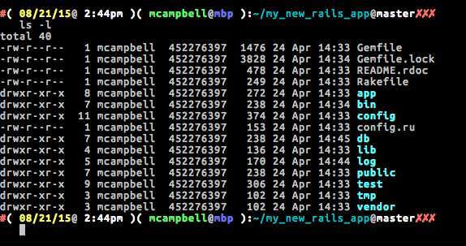

# Stupid command line tricks

---


## Sportsball! Also eSports. And fantasy?

---

# Shell/bash/zsh

## emacs mode is default mode

---

## Emacs bindings

`ctrl-u -` delete to beginning of line
`ctlr-k -` delete to end of line
`ctrl-a -` go to beginning of line
`ctrl-e -` go to end of line
`ctrl-r -` search through history (hit ctrl-r to keep going)
`ctrl-w -` delete word backward

---

## Edit current line in your editor

```
export VISUAL=vim # nano, emacs, subl, etc.
export EDITOR=vim
ctrl-x e
```

---

## vi mode for command line

Enable with: `set -o vi`

Turn off with: `set +o vi`

Works in bash, zsh, ksh, and more.

(pro tip: check out `set -o`)

---

## vi bindings

`esc` - enter command mode
`i`  - enter insert mode
`u` - undo
`/` - search through history (n/N to cycle through matches)
`j/k` - go back/forward in history
`b/w` - to go back/forward a word
`0/$` - go to beginning/end of line
`x` - to delete a character

---

## Directions work

`d3w` - delete 3 words
etc.

---

## Edit current line in your editor

```
export VISUAL=vim # nano, emacs, subl, etc.
export EDITOR=vim
esc # enter command mode
v # edit with VISUAL/EDITOR
```

---

## Command substitution

Command substitution with \`\` or '`$()`':


```
# old backtick style
rm `cat list_of_files_to_delete`

# can nest with $()
rm $(cat list_of_files_to_delete)
```

--- 

## Piping commmand output

Pipe character takes input from other commmands:

```
echo "Hello, world" | tr '[a-z]' '[A-Z]'
# HELLO, WORLD
```

---

## Glob expansion

Renaming nested files without retyping out the path:

```
cp /home/foo/some_file.cpp /home/foo/some_file.cpp-old
cp /home/foo/some_file.cpp{,-old}
cp /home/foo/some_file.{cpp,cpp-old}
```

---

## Go to home directory

No need for '`cd ~`', just do this:

```
cd
```

---

## The dash (-) character

The '-' character usually means use the previous thing:

```
cd - # go to previous directory
git checkout - # checkout previous branch
git merge - # merge previous branch into current branch
```

---

## Git completion

zsh/bash can know about git if you want it to.

```
git checkout SPORTS-*tab*
->
git checkout SPORTS-123-my-branch-blah-blah-blah
```

Works for all other git commands (merge, branch, etc.)

---

## Command repeat

'`!!`' repeats your last command:

```
touch /var/root/file_a
touch: /var/root/file_a: Permission denied
sudo !!
```

---


## HEREDOC on command line

```
cat <<EOF
Hello, world
EOF
# outputs 'Hello, world'
```

---

## End standard-in with ctrl-d

Type this out on the command line:

```
cat <Enter>
Hello, world <Enter>
<ctrl-d>
```

---

## Use ctrl-d to exit

Exits a lot of stuff (irb, any shell, pry prompts, etc.).

```
$ irb --simple-prompt
>> 1 + 1
=> 2
>> <ctrl-d>
$
```

---

## Visual block select

In Terminal/iTerm:

⌘-alt click and drag



---

## Open output in editor

```
# vim
ls -l | vim -
```

---

## Tree of files


```
find .
```

---

## Find files

```
find . | grep file_a
```

---

## ssh tricks

ssh config can have aliases:

```
# ~/.ssh/config
Host host-a a-host my-super-alias-for-host-a
  Hostname foo-bar.compute-1.amazonaws.com
  User ubuntu
  ForwardX11 no
```

---

## Use the alias

```
ssh host-a # ssh to host-a
scp host-a:/tmp/file_a.txt . # scp from host-a
ssh host-a ls -l /tmp/file_a.txt # run command on host-a
```

---

# Fin

Thanks!

Sometimes I blog: markcampbell.me

Twitter: @Nitrodist
